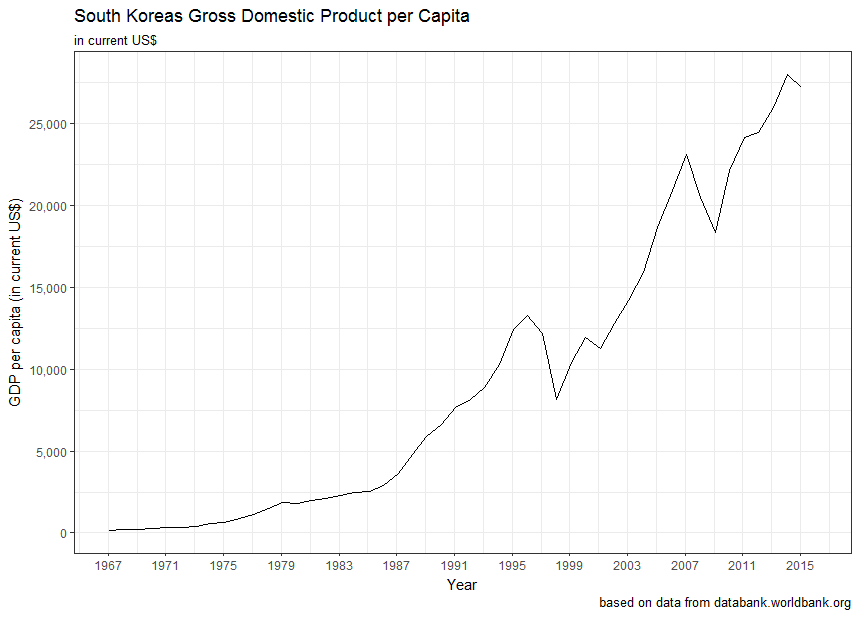

[](http://quantlet.de/)

## [](http://quantlet.de/) **PlotGDPpCapita** [](http://quantlet.de/)

```yaml

Name of QuantLet : PlotGDPpCapita

Published in : Bachelor Thesis "Nutrition Changes in South Korea"

Description : 'Plots the South Korean GDP per Capita (in current USD) data from 1967 - 2015 using
ggplot2.'

Keywords : ggplot2, gdp per capita, gdp, line chart, data visualization

Author : Darius Jonda

Submitted : 2016-02-02 by Darius Jonda

Datafile: 
- korea_gdp_p_capita.xlsx: 'Gross Domestic Products dataset in current USD. Source:
databank.worldbank.org'

```




### R Code:
```r
# Read in libraries
library(dplyr)
library(tidyr)
library(scales)
library(readxl)
library(ggplot2)

# Read in World Bank dataset containing the South Korean GDP per capita
# mutate YEAR variable to Date object and GDPPC variable to numeric
gdp = read_excel("korea_gdp_p_capita.xlsx") %>%
  select(-c(1:3)) %>%
  gather(YEAR, GDPPC, -CountryCode) %>%
  mutate(YEAR = as.Date(substr(YEAR, 1, 4), format = "%Y"),
         GDPPC = as.numeric(as.character(GDPPC)))

# Plot data using a linechart (from 1967 - 2015)
# x-Axis labels are displayed in 4 year increments
ggplot(gdp, aes(x = YEAR, y = GDPPC)) +
  geom_line(group = 1) +
  labs(
    title = "South Koreas Gross Domestic Product per Capita",
    subtitle = "in current US$",
    caption = "based on data from databank.worldbank.org",
    x = "Year",
    y = "GDP per capita (in current US$)"
  ) +
  theme_bw() +
  scale_y_continuous(breaks = seq(0, 30000, by = 5000), labels = comma) +
  scale_x_date(breaks =  seq(as.Date("1967-01-05"), as.Date("2016-01-05"),
                             by = "4 years"),
               labels = date_format("%Y"))

```
